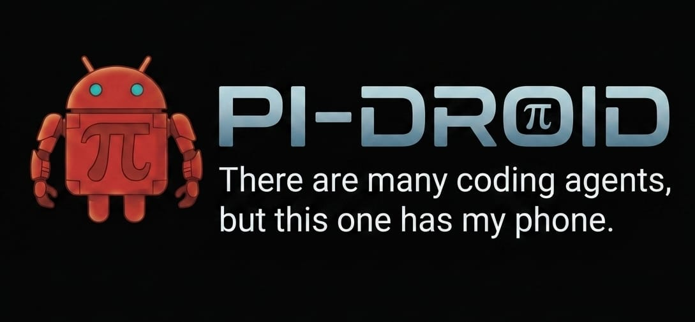

# Pi-Droid



Android automation extension for [pi-agent](https://github.com/badlogic/pi-mono). Gives AI agents direct control over Android devices via ADB.

[](https://www.npmjs.com/package/@artemisai/pi-droid)
[](./LICENSE)
[]()
[]()

---

## Features

- **36 LLM-visible tools** for full Android device control -- perception, input, navigation, system management, automation, and plugin execution
- **Annotated screenshots** with numbered element indices for precise, resolution-independent interaction
- **Plugin system** for app-specific automation -- extend `CliPlugin` or implement `PiDroidPlugin`, distribute as npm packages
- **4 skill definitions** that scope tool sets for focused agent behavior
- **Deterministic input routing** for common one-tool actions without LLM reasoning overhead
- **Multi-device support** with device registry and serial-based targeting
- **Gesture macros** for recording, saving, and replaying complex touch sequences
- **Screen lock management** -- query, set, and clear PIN/pattern locks programmatically
- **WiFi ADB** for wireless device connections
- **OCR fallback** via Tesseract for reading text in WebViews and dynamic content
- **Full public API** -- import ADB primitives directly for building custom automation

---

## Prerequisites

| Requirement | Notes |
|-------------|-------|
| **Node.js** >= 18 | ESM support required |
| **ADB** on PATH | Android Debug Bridge (`adb devices` should list your device) |
| **Android device** | USB debugging enabled, connected via USB or WiFi |
| **[ADBKeyboard](https://github.com/nicetab/ADBKeyboard)** | Required for Unicode text input via `android_type` |
| **Tesseract OCR** *(optional)* | Only needed for `android_ocr` tool |

---

## Installation

Install as a pi-agent extension:

```bash
pi install npm:@artemisai/pi-droid
```

Set your device serial (optional if only one device is connected):

```bash
export ANDROID_SERIAL=your_device_serial
```

---

## Quick Start

### As a pi-agent extension (recommended)

```bash
pi install npm:@artemisai/pi-droid
```

Once installed, all 36 tools and 4 skills are available to the agent automatically. Start a pi session and ask it to interact with your Android device.

### Development mode

```bash
git clone https://github.com/ArtemisAI/pi-droid.git
cd pi-droid
npm install
pi -e ./src/index.ts
```

### Verify device connection

```bash
npx tsx run.mts screen
```

---

## Tool Reference

### Perception (6 tools)

| Tool | Description |
|------|-------------|
| `android_look` | Annotated screenshot with numbered element index -- primary perception tool |
| `android_screenshot` | Raw screenshot -- use for failure diagnosis only |
| `android_ui_dump` | Raw UI tree XML for full element hierarchy |
| `android_ocr` | Tesseract OCR on current screen or saved screenshot |
| `android_observe` | Continuous screen state observation |
| `android_screen_state` | Current activity, package, orientation, lock state as JSON |

### Input (5 tools)

| Tool | Description |
|------|-------------|
| `android_tap` | Tap by coordinates, text match, or resource ID; supports long press |
| `android_type` | Type text into the focused field; optional `clear_first` to replace |
| `android_swipe` | Swipe between two coordinates with configurable duration |
| `android_scroll` | Scroll up or down on the current screen |
| `android_key` | Press a key: `back`, `home`, `enter`, `tab`, or any `KEYCODE_*` |

### App and Navigation (3 tools)

| Tool | Description |
|------|-------------|
| `android_app` | Launch, stop, or check status of an app by package name |
| `android_wait` | Wait for an element to appear (by text or resource ID) with timeout |
| `android_wait_activity` | Wait for a specific activity to reach the foreground |

### System (6 tools)

| Tool | Description |
|------|-------------|
| `android_device_info` | Battery, network, and hardware info |
| `android_settings` | Read/write system settings (WiFi, Bluetooth, brightness, volume, etc.) |
| `android_processes` | List running processes, kill by PID or name |
| `android_logcat` | Capture, search, and clear logcat |
| `android_shell` | Execute arbitrary ADB shell commands |
| `android_install` | Install/uninstall APKs, check package versions |

### Device Management (3 tools)

| Tool | Description |
|------|-------------|
| `android_devices` | List connected devices, register/unregister, set active device |
| `android_preflight` | Run device readiness checks (ADB, screen, battery, etc.) |
| `android_wifi` | Connect/disconnect WiFi ADB, auto-discover devices |

### Lock Management (4 tools)

| Tool | Description |
|------|-------------|
| `android_lock_status` | Query current lock state and type |
| `android_lock_clear` | Remove existing lock |
| `android_lock_set_pattern` | Set a pattern lock |
| `android_lock_set_pin` | Set a PIN lock |

### Recording and Macros (2 tools)

| Tool | Description |
|------|-------------|
| `android_record` | Start/stop screen recording, pull recordings |
| `android_macro` | Record, save, load, and replay gesture macros |

### Automation (3 tools)

| Tool | Description |
|------|-------------|
| `android_ensure_ready` | Wake screen, unlock, dismiss overlays -- call before any automation |
| `android_find_and_tap` | Search UI tree for element and tap it; retries with scrolling |
| `android_scroll_find` | Scroll until an element appears, then return it |

### Plugin System (4 tools)

| Tool | Description |
|------|-------------|
| `android_skills` | Discover all loaded plugin capabilities and parameters |
| `android_plugin_action` | Execute a plugin action with approval gates for sensitive operations |
| `android_plugin_status` | Get health status of all loaded plugins |
| `android_plugin_cycle` | Run a plugin's autonomous heartbeat cycle |

---

## Skills

Pi-Droid defines four skills that scope tool sets for focused agent behavior. Skills are discovered automatically by pi-agent's package manager.

| Skill | Description | Key Tools |
|-------|-------------|-----------|
| `android-screen` | Perceive device state | `look`, `screen_state`, `screenshot`, `ui_dump`, `ocr`, `observe` |
| `android-interact` | Perform actions on the device | `tap`, `type`, `swipe`, `scroll`, `key`, `app` |
| `android-automate` | High-level automation sequences | `ensure_ready`, `find_and_tap`, `scroll_find`, `wait`, `wait_activity`, `preflight` |
| `android-plugin` | Manage and execute app plugins | `skills`, `plugin_action`, `plugin_status`, `plugin_cycle` |

---

## Plugin System

Pi-Droid's plugin system lets you add app-specific automation behind a standard interface. Plugins can declare approval gates for sensitive actions (sending messages, making purchases, posting content).

### Building a plugin

Extend `CliPlugin` for CLI-backed apps, or implement `PiDroidPlugin` for full control:

```typescript
import { CliPlugin } from "@artemisai/pi-droid";

export class WeatherPlugin extends CliPlugin {
  name = "weather";
  // ...
}
```

### Loading plugins

Plugins are configured in `config/default.json` and loaded automatically on session start:

```json
{
  "plugins": {
    "weather": {
      "enabled": true,
      "package": "@example/pi-droid-weather"
    }
  }
}
```

Distribute plugins as npm packages. See [PLUGINS.md](./PLUGINS.md) for the full plugin development guide, manifest schema, and marketplace integration.

---

## Configuration

Pi-Droid reads configuration from `config/default.json`:

```json
{
  "adb": {
    "serial": "your_device_serial"
  },
  "plugins": {},
  "routing": {}
}
```

| Key | Purpose |
|-----|---------|
| `adb.serial` | Device serial (overridden by `ANDROID_SERIAL` env var) |
| `plugins` | Plugin configurations keyed by name |
| `routing` | Input router settings for deterministic action dispatch |

Environment variables:

| Variable | Purpose |
|----------|---------|
| `ANDROID_SERIAL` | Target device serial (takes precedence over config) |

---

## Development

```bash
# Install dependencies
npm install

# Compile TypeScript
npm run build

# Type-check without emitting
npm run lint

# Run all tests (580+)
npm test

# Run unit tests only
npm run test:unit

# Run integration tests
npm run test:integration

# Watch mode
npm run test:watch

# Development mode (load as pi extension)
npm run dev
```

### Project structure

```
src/
  index.ts          Extension entry point
  adb/              ADB primitives (app-agnostic, 28 modules)
  tools/            LLM tool registrations
  plugins/          Plugin system (loader, CLI base class, marketplace)
  notifications/    Notification channels and approval queues
skills/             Skill definitions (scoped tool sets)
tests/              580+ tests mirroring src/ structure
config/             Default configuration
```

---

## Programmatic Usage

Pi-Droid exports its full ADB layer for use in custom automation scripts, external plugins, or standalone tools:

```typescript
import {
  Device,
  tap, swipe, typeText, keyEvent,
  takeScreenshot, annotatedScreenshot,
  getScreenState, waitForActivity,
  launchApp, stopApp,
  dumpUiTree, findElement, waitForElement,
  ensureReady, findAndTap, scrollToFind,
  getBatteryInfo, getDeviceInfo,
  adbShell,
} from "@artemisai/pi-droid";

// Connect to a device
const device = await Device.connect(process.env.ANDROID_SERIAL);

// Take an annotated screenshot with numbered elements
const annotated = await annotatedScreenshot();

// Find and tap an element by text
await findAndTap({ text: "Settings" });

// Wait for an activity transition
await waitForActivity("com.android.settings/.Settings");

// Run a raw ADB shell command
const result = await adbShell("dumpsys battery");
```

### Available exports

- **Device abstraction**: `Device`
- **Command execution**: `adb`, `adbShell`, `AdbError`, `listDevices`, `isDeviceReady`
- **Input**: `tap`, `swipe`, `typeText`, `keyEvent`, `pressBack`, `pressHome`, `pressEnter`, `scrollDown`, `scrollUp`
- **Screen state**: `getScreenState`, `waitForActivity`, `getActivityStack`, `isKeyboardVisible`, `getOrientation`
- **Screenshots and perception**: `takeScreenshot`, `screenshotBase64`, `annotatedScreenshot`, `dumpUiTree`, `findElements`, `findElement`, `waitForElement`
- **App management**: `launchApp`, `stopApp`, `getAppInfo`, `listPackages`, `wakeScreen`, `isScreenOn`
- **Monitoring**: `getBatteryInfo`, `getNetworkInfo`, `getDeviceInfo`, `isScreenLocked`, `getRunningApps`
- **Automation**: `ensureReady`, `findAndTap`, `scrollToFind`, `DefaultStuckDetector`, `createTaskBudget`
- **OCR**: `runOcrOnImage`, `runOcrOnCurrentScreen`
- **Plugin system**: `PluginManager`, `CliPlugin`, `TelegramPlugin`, `ApprovalQueue`
- **Types**: `AdbExecOptions`, `UIElement`, `Bounds`, `ElementSelector`, `StuckEvent`, and more

---

## Contributing

See [CONTRIBUTING.md](./CONTRIBUTING.md) for development guidelines, coding standards, and the PR checklist.

---

## License

[MIT](./LICENSE) -- ArtemisAI
